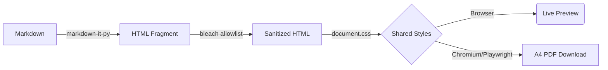

<div align="center">

<!-- You can replace this banner with an actual screenshot of your dark-themed UI -->
<!--  -->

<a href="https://markdown-to-pdf-h0u7.onrender.com">
    
  </a>
<sub><i>The hero banner was AI-generated using Google Gemini.</i></sub>

## Convert Markdown revision notes into polished A4 PDFs right in the browser.

[](https://markdown-to-pdf-h0u7.onrender.com) [](https://www.python.org/) [](https://fastapi.tiangolo.com/) [](https://playwright.dev/)

> **Upload / Paste Markdown &nbsp; &nbsp; &nbsp; &nbsp; · &nbsp; &nbsp; &nbsp; &nbsp; Live Preview &nbsp; &nbsp; &nbsp; &nbsp; · &nbsp; &nbsp; &nbsp; &nbsp; Download PDF**
> Markdown in. &nbsp; A clean A4 PDF out.

<p>
  <a href="https://markdown-to-pdf-h0u7.onrender.com"><b>View Live Demo</b></a> •
  <a href="#-api-reference"><b>API Docs</b></a> •
  <a href="#-local-development"><b>Self-Host</b></a>
</p>

</div>

---
<div align = "center">
<!--  -->
<!--  -->
<!-- *(Above: Live preview in action. What you see on the screen is exactly what gets rendered to the PDF.)* -->

<p align="center">
  
  <em>Above: Live preview in action. What you see on the screen is exactly what gets rendered to the PDF.</em>
</p>

</div>

---

## One sentence version

> An LLM-friendly document format should not force you into an LLM-specific reading experience.

That is the gap this project is built to close.

---

## Why this project exists

The problem is not Markdown. **It is the last mile.**

LLMs work well with structured text, and Markdown is a natural interchange format across AI-assisted writing, documentation, and developer workflows. Formatting also matters to model behavior; research has found that prompt formatting can materially affect performance on some tasks. See [Does Prompt Formatting Have Any Impact on LLM Performance?](https://arxiv.org/abs/2411.10541) and [FMBench: Adaptive Large Language Model Output Formatting](https://arxiv.org/abs/2602.06384).

Markdown is a compact textual representation of document structure. Exact token counts still depend on the tokenizer, the content, and the competing format, so this is not a claim that Markdown always uses fewer tokens. The bigger optimization is the workflow: the model can finish the document as Markdown in one response instead of also handling layout, pagination, file packaging, invoking a PDF-generation tool, or reading a pdf-generation skill. This project moves that last mile outside the LLM loop.

So the workflow should be simple:

```text

you ask for a document

&#x20;       ↓

LLM produces Markdown

&#x20;       ↓

this app renders it

&#x20;       ↓

you get a polished PDF

```

The LLM handles **content and structure**.
This app handles **rendering and pagination**.

That means no second prompt to “turn this into a PDF,” no extra AI formatting pass, and no hunting for a converter or installing a Markdown editor just to make the file shareable.

**Markdown is the working format. PDF is the handoff format.**

This project sits between them.

**Markdown in. A polished A4 PDF out.**

No Pandoc. No desktop editor. No account. No document library.

Just **write → preview → download**.

---

## ✨ Features

- **True WYSIWYG:** The exact same CSS styles the browser preview and the headless Chromium renderer. No layout drift.
- **Dark/Light UI Theme:** A polished UI with a dark mode toggle (your actual PDF always stays clean and print-ready).
- **Secure & Ephemeral:** Zero persistence. No databases. No accounts. Markdown goes in, PDF comes out, memory is wiped.
- **Developer Ready:** Exposes a single, fast REST API endpoint for automation.

---

## 🏗️ Architecture
Behind the scenes, the server renders the PDF using Headless Chromium, ensuring modern CSS and typography support.
A single FastAPI service serves the frontend and renders the PDFs server-side using Playwright. 



<details>
<summary><b>📂 Click to peek at the Project Structure</b></summary>

```text
markdown-to-pdf/
├── app/
│   ├── main.py           # FastAPI app & API routes
│   ├── markdown.py       # GFM parsing & HTML sanitization
│   ├── pdf.py            # Playwright PDF rendering
│   ├── templates/
│   │   └── index.html    # Single-page frontend shell
│   └── static/
│       ├── app.js        # Vanilla JS logic
│       ├── styles.css    # App UI chrome (Dark/Light mode)
│       ├── document.css  # Shared PDF stylesheet
│       └── vendor/       
└── README.md
```
</details>

---

## 🚀 Usage 

### Web Interface
Simply visit the [Live App](https://markdown-to-pdf-h0u7.onrender.com), paste your Markdown into the editor, and click Download.

### API Reference
You can bypass the UI and generate PDFs programmatically. 

**`POST /api/pdf`**

```bash
curl -X POST https://markdown-to-pdf-h0u7.onrender.com/api/pdf \
  -H "Content-Type: application/json" \
  -d '{
    "markdown": "# Revision Notes\n\nHere are my notes...",
    "filename": "custom_name.md"
  }' \
  --output custom_name.pdf
```

*Note: `filename` is optional. If omitted, the API will smartly name the PDF based on the first `# H1` tag in your Markdown.*


**Response:**
Returns `application/pdf` with `Content-Disposition: attachment`.

| Error Code | Why it happened |
| :--- | :--- |
| `400` | Markdown payload is empty or whitespace-only. |
| `413` | Markdown exceeds 5 MB (or request body > 8 MB). |
| `502` | Chromium failed to render the document |
| `500` | Unhandled server error |


**Limits & Safety:**
- Max Markdown payload: `5 MB`
- Max Request body: `8 MB`
- Content is strictly sanitized; raw HTML passthrough is disabled.

**`GET /health`**

`{"status": "ok"}` — used as Render's health check.

**`GET /api/stats`**

```json
{
  "conversions": 128,
  "github_stars": 342,
  "github_repo_url": "https://github.com/your-username/markdown-to-pdf"
}
```

**`GET /api/quote`**

```json
{"text": "...", "author": "..."}
```

One random entry from `app/data/quotes.json`, for the footer.

---

## Security & privacy

The service is intentionally small, but it does not treat “small” as permission to skip the important parts.
- Raw HTML passthrough is disabled during Markdown parsing.
- Generated HTML is sanitized with an explicit Bleach allowlist before Chromium renders it.
- Scripts, `javascript:` URLs and event-handler attributes are stripped from the render path.
- There is no database and no persistence layer.
- Markdown is capped at **5 MB** and the request body at **8 MB**.
- Server logs record request lifecycle events, not the Markdown body.


The intended lifecycle is simple:
```text

receive → convert → return PDF → discard
```

---

## 💻 Local Development

Requires **Python 3.11+**.

1. **Clone & setup virtual environment:**
   ```bash
   python -m venv .venv
   source .venv/bin/activate  # On Windows: .venv\Scripts\activate
   ```

2. **Install dependencies:**
   ```bash
   pip install -r requirements.txt
   ```

3. **Install headless Chromium (Playwright):**
   ```bash
   python -m playwright install --with-deps chromium
   ```

4. **Run the server:**
   ```bash
   uvicorn app.main:app --reload --port 8000
   ```

Open `http://127.0.0.1:8000` to see the app running locally.

---

## Research note

The claim here is deliberately narrower than “Markdown is universally better for every LLM.” Research does show that prompt formatting can materially affect model behavior on some tasks; one study comparing plain text, Markdown, JSON, and YAML found substantial differences for some GPT-3.5 tasks, while larger models were more robust. ([He et al., 2024 — *Does Prompt Formatting Have Any Impact on LLM Performance?*](https://arxiv.org/abs/2411.10541))

Recent work also describes Markdown as ubiquitous in assistants, documentation, and tool-augmented pipelines, which is exactly the ecosystem this project is designed around. ([Wang et al., 2026 — *FMBench: Adaptive Large Language Model Output Formatting*](https://arxiv.org/abs/2602.06384))

The token-efficiency point is best understood as a workflow property rather than a universal benchmark claim: Markdown is a compact textual representation of document structure, while exact token counts vary by tokenizer. The bigger win is avoiding a second LLM generation step or an LLM-side file-generation/tool workflow merely to turn already-finished Markdown into a PDF.

That is the premise: **let the model stop at the format it is already good at producing, and make the human-friendly artifact one conversion away.**

---

Built to remove one small, annoying step from an increasingly common AI → document workflow.