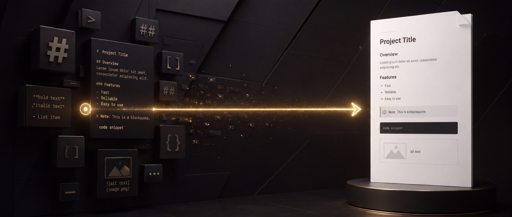
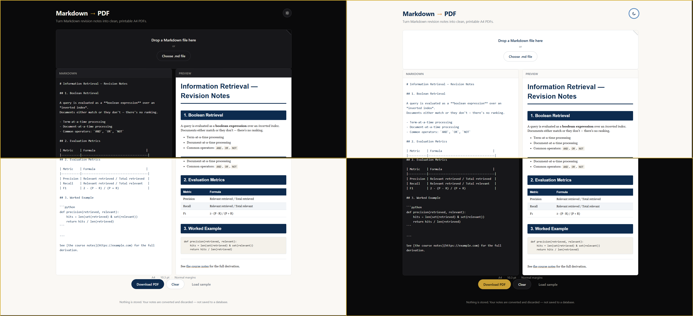
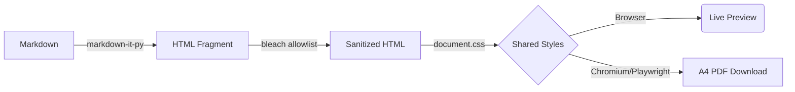

<div align="center">

<!-- You can replace this banner with an actual screenshot of your dark-themed UI -->
<!--  -->

<a href="https://markdown-to-pdf-h0u7.onrender.com">
    
  </a>
<!-- <sub><i>The hero banner and demo GIF were AI-generated using Google Gemini.</i></sub> -->
<sub><i>The hero banner was AI-generated using Google Gemini.</i></sub>

## Convert Markdown revision notes into polished A4 PDFs right in the browser.

[](https://www.python.org/) [](https://fastapi.tiangolo.com/) [](https://playwright.dev/) [](https://markdown-to-pdf-h0u7.onrender.com)

> **Upload / Paste Markdown &nbsp; | &nbsp; Live Preview &nbsp; | &nbsp; Download PDF**

<p>
  <a href="https://markdown-to-pdf-h0u7.onrender.com"><b>View Live Demo</b></a> •
  <a href="#-api-reference"><b>API Docs</b></a> •
  <a href="#-local-development"><b>Self-Host</b></a>
</p>

</div>



<!--  -->
*(Above: Live preview in action. What you see on the screen is exactly what gets rendered to the PDF.)*

---

## ✨ Features

- **True WYSIWYG:** The exact same CSS styles the browser preview and the headless Chromium renderer. No layout drift.
- **Dark/Light UI Theme:** A polished UI with a dark mode toggle (your actual PDF always stays clean and print-ready).
- **Secure & Ephemeral:** Zero persistence. No databases. No accounts. Markdown goes in, PDF comes out, memory is wiped.
- **Developer Ready:** Exposes a single, fast REST API endpoint for automation.

---

## 🏗️ Architecture
Behind the scenes, the server renders the PDF using Headless Chromium, ensuring modern CSS and typography support.
A single FastAPI service serves the frontend and renders the PDFs server-side using Playwright. 



<details>
<summary><b>📂 Click to peek at the Project Structure</b></summary>

```text
markdown-to-pdf/
├── app/
│   ├── main.py           # FastAPI app & API routes
│   ├── markdown.py       # GFM parsing & HTML sanitization
│   ├── pdf.py            # Playwright PDF rendering
│   ├── templates/
│   │   └── index.html    # Single-page frontend shell
│   └── static/
│       ├── app.js        # Vanilla JS logic
│       ├── styles.css    # App UI chrome (Dark/Light mode)
│       ├── document.css  # Shared PDF stylesheet
│       └── vendor/       
└── README.md
```
</details>

---

## 🚀 Usage 

### Web Interface
Simply visit the [Live App](https://markdown-to-pdf-h0u7.onrender.com), paste your Markdown into the editor, and click Download.

### API Reference
You can bypass the UI and generate PDFs programmatically. 

**`POST /api/pdf`**

```bash
curl -X POST https://markdown-to-pdf-h0u7.onrender.com/api/pdf \
  -H "Content-Type: application/json" \
  -d '{
    "markdown": "# Revision Notes\n\nHere are my notes...",
    "filename": "custom_name.md"
  }' \
  --output custom_name.pdf
```

*Note: `filename` is optional. If omitted, the API will smartly name the PDF based on the first `# H1` tag in your Markdown.*


**Response:**
Returns `application/pdf` with `Content-Disposition: attachment`.

| Error Code | Why it happened |
| :--- | :--- |
| `400` | Markdown payload is empty or whitespace-only. |
| `413` | Markdown exceeds 5 MB (or request body > 8 MB). |
| `500` / `502` | Chromium failed to render or unhandled server error. |


**Limits & Safety:**
- Max Markdown payload: `5 MB`
- Max Request body: `8 MB`
- Content is strictly sanitized; raw HTML passthrough is disabled.

---

## 💻 Local Development

Requires **Python 3.11+**.

1. **Clone & setup virtual environment:**
   ```bash
   python -m venv .venv
   source .venv/bin/activate  # On Windows: .venv\Scripts\activate
   ```

2. **Install dependencies:**
   ```bash
   pip install -r requirements.txt
   ```

3. **Install headless Chromium (Playwright):**
   ```bash
   python -m playwright install --with-deps chromium
   ```

4. **Run the server:**
   ```bash
   uvicorn app.main:app --reload --port 8000
   ```

Open `http://127.0.0.1:8000` to see the app running locally.

---
<div align="center">
  <i>Built with FastAPI, Playwright, and markdown-it.</i>
</div>